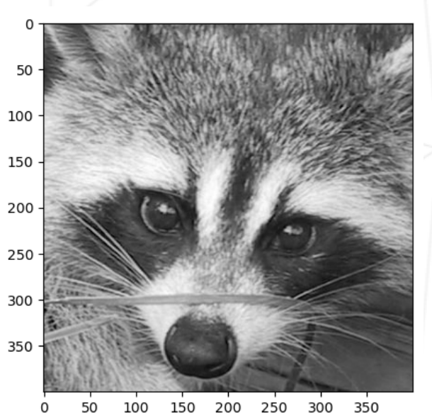
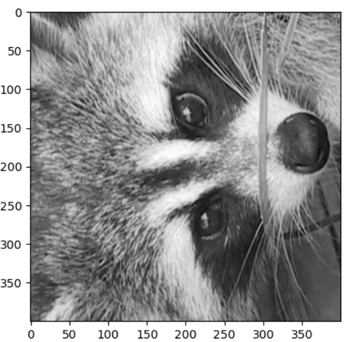
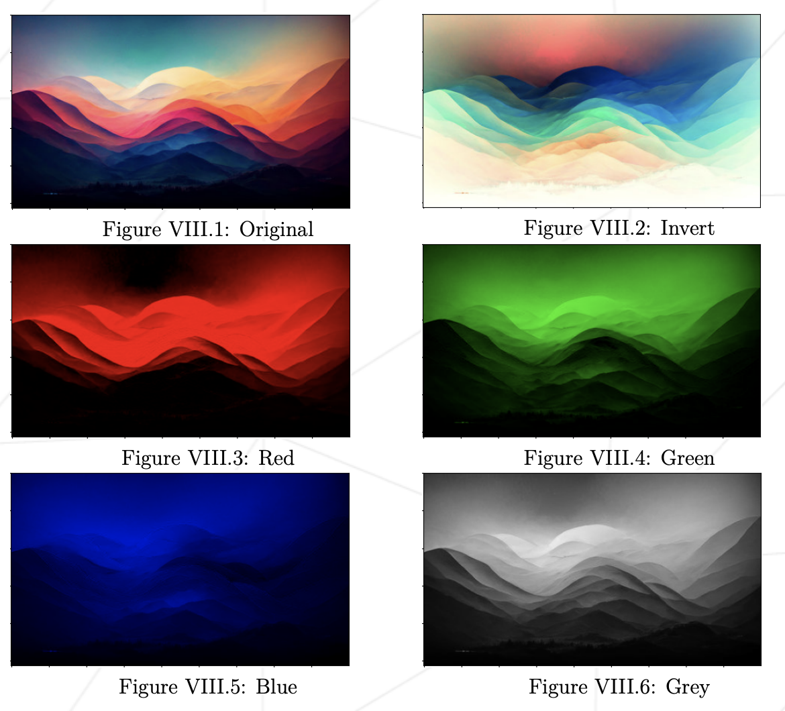

# Subject 번역

## General Rules

-   VM을 사용하여 클러스터 컴퓨터에서 모듈을 렌더링해야 합니다.
    -   가상 머신에 사용할 OS를 선택할 수 있습니다.
    -   가상 머신에 프로젝트를 구현하는 데 필요한 모든 소프트웨어가 있어야 합니다. 이 소프트웨어를 구성하고 설치해야 합니다.
-   또는 도구를 사용할 수 있는 경우, 컴퓨터에 직접 설치할 수 있습니다.
    -   세션에 필요한 모든 모듈을 설치할 수 있는 공간이 있는지 확인합니다. (캠퍼스에 있는 경우 goinfre 사용)
    -   평가 전에 모든 모듈을 설치해야 합니다.
-   함수들은 예상치 못하게 종료되면 안됩니다. (segmentation fault, bus error, double free 등) 예상치 못한 종료가 일어난다면, 당신의 프로젝트는 비 기능적인 것으로 간주되며 0점을 받게 됩니다.
-   프로젝트에 대한 테스트 프로그램을 만드는 것을 강력 권장합니다.
    -   제출할 필요가 없고, 채점되지 않습니다.
    -   이렇게 하면 자신의 작업과 동료의 작업을 쉽게 테스트할 수 있습니다. 특히, 디펜스 시 유용합니다.
    -   실제로 디펜스 하는 동안, 자신의 테스트 및 평가하는 동료의 테스트를 자유롭게 사용할 수 있습니다.
-   당신의 모든 작업을 git 레포지토리에 제출하세요. git 레포지토리에 제출된 작업물만 점수를 받을 수 있습니다. 만약 Deepthought이 작업물을 채점하게 되어있다면, 동료평가를 마친 뒤 자동으로 채점될 것입니다. Deepthought은 작업물의 에러를 발견한 순간 채점을 중지합니다.
-   반드시 `Python 3.10` 을 사용해야 합니다.
-   각 예제에서 금지되지 않은 모든 빌트인 함수를 사용할 수 있습니다.
-   모든 라이브러리 import는 명시적이여야 합니다.
    -   `import numpy as np` 형식으로 사용해야 하며,
    -   `from pandas import *` 와 같은 형식은 허용되지 않습니다.
    -   허용되지 않은 import 형식을 사용할 경우, 0점을 받게 됩니다.
-   전역 변수를 사용해서는 안됩니다.

## 추가되는 규칙

-   전역 스코프 사용을 금지합니다. 함수를 사용하세요!
-   각 프로그램은 반드시 `main()`함수가 있어야 하며, 단순한 스크립트가 아니여야 합니다.

```python
def main():
	# 테스트와 에러 헨들링

if __name__ == "__main__":
	main()
```

-   _catch_ 되지 않은 `exception`의 발생은 해당 예제의 점수를 0점으로 처리합니다. 테스트하기 위해 의도적으로 발생시키는 `exception` 또한 이 규칙이 적용됩니다.
-   당신의 모든 함수는 문서화되어야 합니다. (`__doc__`)
-   당신의 코드는 반드시 `norm`을 지켜야 합니다.
    -   `pip install flake8`
    -   `alias norminette = flake8`

## Ex 00

> `ex00/give_bmi.py` 로 제출
>
> `numpy` 또는 표(table) 조작이 가능한 라이브러리

정수 또는 실수로 이루어진 리스트 2개를 입력으로 받아서 BMI 값 리스트를 반환하는 함수 `give_bmi`를 작성하세요.
정수 또는 실수로 이루어진 리스트 2개와 제한 값으로 삼을 정수를 받는 함수 `apply_limit`를 작성하세요. `boolean` 리스트를 반환하며, 제한 값을 넘었다면 `True`입니다.

프로토타입은 다음과 같습니다.

```python
def give_bmi(height: list[int | float], weight: list[int | float]) -> list[int | float]:
	#your code here

def apply_limit(bmi: list[int | float], limit: int) -> list[bool]
	#your code here
```

`tester.py`는 다음과 같습니다.

```python
from give_bmi import give_bmi, apply_limit

height = [2.71, 1.15]
weight = [165.3, 38.4]

bmi = give_bmi(height, weight)
print(bmi, type(bmi))
print(apply_limit(bmi, 26))
```

예상되는 출력은 다음과 같습니다.

```python
$> python tester.py
[22.507863455018317, 29.0359168241966] <class 'list'>
[False, True]
$>
```

## Ex 01

> `ex01/array2D.py`로 제출
>
> `numpy` 또는 표(table) 조작이 가능한 라이브러리 허용

2D 배열과 `start: int`, `end: int`를 인자로 받는 함수를 작성하세요. 그것의 크기(주: shape라고 써져있음. matrix size를 의미하는 듯)를 출력하고, `start`와 `end` 에 기반하여 슬라이싱 후 잘려있는 배열을 반환합니다.
반드시 슬라이싱 메서드를 사용해야 합니다.
인자로 넘어오는 배열에 속한 리스트들이 다른 크기이거나, 리스트가 아니거나 하는 등의 예외 케이스를 핸들링 해야 합니다.

프로토타입은 다음과 같습니다.

```python
def slice_me(family: list, start: int, end: int) -> list:
	#your code here
```

`tester.py`는 다음과 같습니다.

```python
from array2D import slice_me

family = [[1.80, 78.4],
		 [2.15, 102.7],
		 [2.10, 98.5],
		 [1.88, 75.2],
		 ]

print(slice_me(family, 0, 2))
print(slice_me(family, 1, -2))
```

예상되는 출력은 다음과 같습니다.

```bash
$> python test_array2D.py
My shape is : (4, 2)
My new shape is : (2, 2)
[[1.8, 78.4], [2.15, 102.7]]
My shape is : (4, 2)
My new shape is : (1, 2)
[[2.15, 102.7]]
$>
```

## Ex 02

> `ex02/load_image.py` 로 제출
>
> 이미지 로드와 표(table) 조작을 지원하는 모든 라이브러리 허용

이미지를 로드하고, 그것의 형식을 출력하고, RGB 형식의 픽셀 값을 출력하는 함수를 작성하세요.
최소한 JPG와 JPEG 포맷을 지원해야 합니다.
에러의 종류와 상관 없이 핸들링 해야 하며, 깔끔한 에러 메시지를 출력해야 합니다.

프로토타입은 다음과 같습니다.

```python
def ft_load(path: str) -> array: (you can return to the desired format)
	#your code here
```

`tester.py`는 다음과 같습니다.

```python
from load_image import ft_loat

print(ft_load("landscape.jpg"))
```

예상되는 출력은 다음과 같습니다.

```bash
$> python tester.py
The shape of image is: (257, 450, 3)
[[[19 42 83]
 [23 42 84]
 [28 43 84]
    ...
 [ 0 0 0]
 [ 1 1 1]
 [ 1 1 1]]]
 $>
```

## Ex 03

> `ex03` 폴더 안에 `load_image.py`, `zoom.py`로 제출
>
> 이미지를 로드하고, 조작하고, 표시하며, 표(table) 조작을 지원하는 모든 라이브러리 허용

`animal.jpeg`를 로드하고, 그것에 대한 정보를 출력하며, `zooming` 후 표시하는 프로그램을 작성하세요.

-   X, Y 축 픽셀 크기
-   채널 수
-   이미지의 픽셀 값
-   이미지 X, Y축의 스케일 표시
    만약 무언가 잘못된다면, 프로그램은 비정상 종료되지 않고 에러의 종류와 상관 없이 핸들링 해야 하며, 깔끔한 에러 메시지를 출력해야 합니다.

예상되는 출력은 다음과 같습니다.

```bash
$> python zoom.py
The shape of image is: (768, 1024, 3)
[[[120 111 132]
 [139 130 151]
 [155 146 167]
      ...
 [120 156 94]
 [119 154 90]
 [118 153 89]]]
New shape after slicing: (400, 400, 1) or (400, 400)
[[[167]
 [180]
 [194]
  ...
 [102]
 [104]
 [103]]]
 $>
```



## Ex 04

> `ex04` 폴더 안에 `load_image.py`, `rotate.py`로 제출
>
> 이미지를 로드하고, 조작하고, 표시하며, 표(table) 조작을 지원하는 모든 라이브러리 허용

`animal.jpeg` 이미지를 로드하여, 정사각형으로 잘라 회전(전치; transpose) 하여 새 이미지를 생성합니다. 새 이미지는 표시되어야 하며, 크기(shape)와 데이터를 출력해야 합니다.

예상되는 출력은 다음과 같습니다.

```python
$> python rotate.py
The shape of image is: (400, 400, 1) or (400, 400)
[[[167]
  [180]
  [194]
   ...
  [102]
  [104]
  [103]]]
New shape after Transpose: (400, 400)
[[167 180 194 ... 64 50 72]
			  ...
 [115 116 119 ... 102 104 103]]
 $>
```



> 💡transpose 결과가 다를 수 있습니다. transpose 메서드에 대해 찾아보면, 도움이 될 것입니다.
> transpose를 직접 구현해야 합니다. transpose에 대한 라이브러리는 허용되지 않습니다.

## Ex 05

> `ex05` 폴더 안에 `load_image.py`, `pimp_image.py`로 제출
>
> 이미지를 로드하고, 조작하고, 표시하며, 표(table) 조작을 지원하는 모든 라이브러리 허용

이미지의 크기는 그대로이며, 여러 가지 색깔 필터를 적용하는 5개의 함수를 작성하세요.

프로토타입은 다음과 같습니다.

```python
def ft_invert(array) -> array:
	#your code here

def ft_red(array) -> array:
	#your code here

def ft_green(array) -> array:
	#your code here

def ft_blue(array) -> array:
	#your code here

def ft_grey(array) -> array:
	#your code here
```

각 함수에는 다음과 같은 몇 가지 제한 연산자가 있습니다: (주어진 것만 사용할 수 있으며, 모두 사용할 필요는 없습니다.)

-   **invert**: =, +, -, \*
-   **red**: =, \*
-   **green**: =, -
-   **blue**: =
-   **grey**: =, /

`tester.py`는 다음과 같습니다.

```python
from load_image import ft_load
from pimp_image import ft_invert
...

array = ft_load("landscape.jpg")
ft_invert(array)
ft_red(array)
ft_green(array)
ft_blue(array)
ft_grey(array)
print(ft_invert.__doc__)
```

예상되는 출력은 다음과 같습니다. (docstring은 다를 수 있습니다.)

```bash
$> python tester.py
The shape of image is: (257, 450, 3)
[[[19 42 83]
 [23 42 84]
 [28 43 84]
    ...
 [ 0 0 0]
 [ 1 1 1]
 [ 1 1 1]]]
    ...
 Inverts the color of the image received.
 $>
```

예상되는 출력은 다음과 같습니다. (반드시 변환된 이미지를 표시해야 합니다.)


